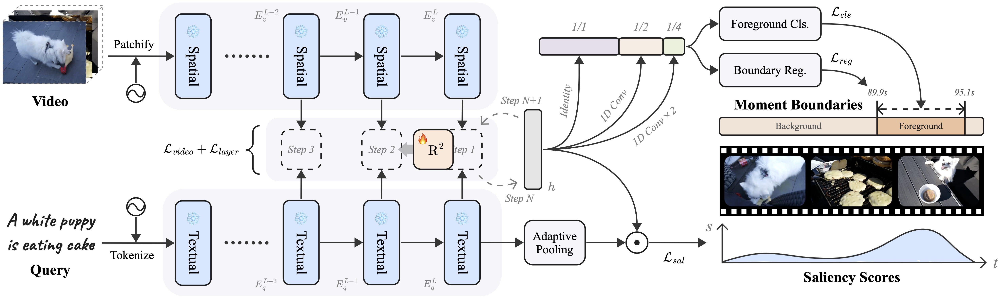

# $\boldsymbol{R^2}$-Tuning

[](https://arxiv.org/abs/2404.00801)
[](https://github.com/yeliudev/R2-Tuning/blob/main/LICENSE)

[**Installation**](#-installation) | [**Dataset**](#-dataset) | [**Training**](#-training) | [**Evaluation**](#-evaluation) | [**Model Zoo**](#-model-zoo)

This repository maintains the official implementation of the paper **$\boldsymbol{R^2}$-Tuning: Efficient Image-to-Video Transfer Learning for Video Temporal Grounding** by [Ye Liu](https://yeliu.dev/), [Jixuan He](https://openreview.net/profile?id=~Jixuan_He1), [Wanhua Li](https://li-wanhua.github.io/), [Junsik Kim](https://sites.google.com/site/jskimcv/), [Donglai Wei](https://donglaiw.github.io/), [Hanspeter Pfister](https://vcg.seas.harvard.edu/people/), and [Chang Wen Chen](https://web.comp.polyu.edu.hk/chencw/).

<p align="center"></p>

## 📮 News

- **[2024.4.16]** Code and dataset release.
- **[2024.3.31]** Our tech report is available on [arXiv](https://arxiv.org/abs/2404.00801).

## 🔨 Installation

Please refer to the following environmental settings that we use. You may install these packages by yourself if you meet any problem during automatic installation.

- CUDA 12.1
- FFmpeg 6.0
- Python 3.12.2
- PyTorch 2.2.1
- [NNCore](https://github.com/yeliudev/nncore) 0.4.2

### Install from source

1. Clone the repository from GitHub.

```shell
git clone https://github.com/yeliudev/R2-Tuning.git
cd R2-Tuning
```

2. Initialize conda environment.

```shell
conda create -n r2-tuning python=3.12 -y
conda activate r2-tuning
```

3. Install dependencies.

```shell
pip install -r requirements.txt
```

## 🔖 Dataset

#### Option 1 [Recommended]: Download pre-extracted features from [HuggingFace Hub](https://huggingface.co/yeliudev/R2-Tuning) directly.

```shell
# Prepare datasets in one command
bash tools/prepare_data.sh
```

#### Option 2: Reproduce our data pre-processing pipeline.

1. Download videos from the following links and place them into `data/{dataset}/videos`.

- [QVHighlights](https://nlp.cs.unc.edu/data/jielei/qvh/qvhilights_videos.tar.gz)
- [Ego4D-NLQ](https://ego4d-data.org/)
- [Charades-STA](https://ai2-public-datasets.s3-us-west-2.amazonaws.com/charades/Charades_v1.zip)
- [TACoS](https://datasets.d2.mpi-inf.mpg.de/MPII-Cooking-2/MPII-Cooking-2-videos.tar.gz)
- [YouTube Highlights](https://github.com/aliensunmin/DomainSpecificHighlight)
- [TVSum](https://people.csail.mit.edu/yalesong/tvsum/tvsum50_ver_1_1.tgz)

2. Extract and compress video frames at a fixed frame rate.

```shell
# For QVHighlights, Ego4D-NLQ, TACoS, and TVSum
python tools/extract_frames.py <path-to-videos>

# For Charades-STA
python tools/extract_frames.py <path-to-videos> --fps 1.0

# For YouTube Highlights
python tools/extract_frames.py <path-to-videos> --anno_path data/youtube/youtube_anno.json
```

<details>
<summary><i>Arguments of <code>tools/extract_frames.py</code></i></summary>
<br>

- `video_dir` Path to the videos folder
- `--anno_path` Path to the annotation file (only for YouTube Highlights to compute frame rates)
- `--frame_dir` Path to the output extracted frames
- `--size` Side length of the cropped video frames
- `--fps` Frame rate to be used
- `--max_len` The maximum length of each video segment
- `--workers` Number of processes
- `--chunksize` The chunk size for each process

</details>

3. Extract features from video frames.

```shell
python tools/extract_feat.py <path-to-anno> <path-to-frames>
```

<details>
<summary><i>Arguments of <code>tools/extract_feat.py</code></i></summary>
<br>

- `anno_path` Path to the annotation file
- `frame_dir` Path to the extracted frames
- `--video_feat_dir` Path to the output video features
- `--query_feat_dir` Path to the output query features
- `--arch` CLIP architecture to use (`ViT-B/32`, `ViT-B/16`, `ViT-L/14`, `ViT-L/14-336px`)
- `--k` Save the last `k` layers features
- `--batch_size` The batch size to use
- `--workers` Number of workers for data loader

</details>

#### The prepared dataset should be in the following structure.

```
R2-Tuning
├── configs
├── datasets
├── models
├── tools
├── data
│   ├── qvhighlights
│   │   ├── frames_224_0.5fps (optional)
│   │   ├── clip_b32_{vid,txt}_k4
│   │   └── qvhighlights_{train,val,test}.jsonl
│   ├── ego4d
│   │   ├── frames_224_0.5fps (optional)
│   │   ├── clip_b32_{vid,txt}_k4
│   │   └── nlq_{train,val}.jsonl
│   ├── charades
│   │   ├── frames_224_1.0fps (optional)
│   │   ├── clip_b32_{vid,txt}_k4
│   │   └── charades_{train,test}.jsonl
│   ├── tacos
│   │   ├── frames_224_0.5fps (optional)
│   │   ├── clip_b32_{vid,txt}_k4
│   │   └── {train,val,test}.jsonl
│   ├── youtube
│   │   ├── frames_224_auto (optional)
│   │   ├── clip_b32_{vid,txt}_k4
│   │   └── youtube_anno.json
│   └── tvsum
│       ├── frames_224_0.5fps (optional)
│       ├── clip_b32_{vid,txt}_k4
│       └── tvsum_anno.json
├── README.md
├── setup.cfg
└── ···
```

## 🔮 Training

Use the following commands to train a model with a specified config.

```shell
# Single GPU
python tools/launch.py <path-to-config>

# Multiple GPUs on a single node (elastic)
torchrun --nproc_per_node=<num-gpus> tools/launch.py <path-to-config>

# Multiple GPUs on multiple nodes (slurm)
srun <slurm-args> python tools/launch.py <path-to-config>
```

<details>
<summary><i>Arguments of <code>tools/launch.py</code></i></summary>
<br>

- `config` The config file to use
- `--checkpoint` The checkpoint file to load from
- `--resume` The checkpoint file to resume from
- `--work_dir` Working directory
- `--eval` Evaluation only
- `--dump` Dump inference outputs
- `--seed` The random seed to use
- `--amp` Whether to use automatic mixed precision training
- `--debug` Debug mode (detect `nan` during training)
- `--launcher` The job launcher to use

</details>

Please refer to the [configs](https://github.com/yeliudev/R2-Tuning/tree/main/configs) folder for detailed settings of each model.

## 🏆 Evaluation

Use the following command to test a model and evaluate results.

```
python tools/launch.py <path-to-config> --checkpoint <path-to-checkpoint> --eval
```

For QVHighlights, you may also dump inference outputs on `val` and `test` splits.

```
python tools/launch.py <path-to-config> --checkpoint <path-to-checkpoint> --dump
```

Then you can pack the `hl_{val,test}_submission.jsonl` files and submit them to [CodaLab](https://codalab.lisn.upsaclay.fr/competitions/6937).

## 📦 Model Zoo

We provide multiple pre-trained models and training logs here. All the models were trained on a single NVIDIA A100 80GB GPU and were evaluated using the default metrics of different datasets.

<table>
  <tr>
    <th>Dataset</th>
    <th>Config</th>
    <th>R1@0.3</th>
    <th>R1@0.5</th>
    <th>R1@0.7</th>
    <th>MR mAP</th>
    <th>HD mAP</th>
    <th>Download</th>
  </tr>
  <tr>
    <td align="center">
      <a href="https://arxiv.org/abs/2107.09609">QVHighlights</a>
    </td>
    <td align="center">
      <a href="https://github.com/yeliudev/R2-Tuning/blob/main/configs/qvhighlights/r2_tuning_qvhighlights.py">Default</a>
    </td>
    <td align="center">78.71</td>
    <td align="center">67.74</td>
    <td align="center">51.87</td>
    <td align="center">47.86</td>
    <td align="center">39.45</td>
    <td align="center">
      <a href="https://huggingface.co/yeliudev/R2-Tuning/resolve/main/checkpoints/r2_tuning_qvhighlights-ed516355.pth">model</a> |
      <a href="https://huggingface.co/yeliudev/R2-Tuning/resolve/main/checkpoints/r2_tuning_qvhighlights.log">log</a>
    </td>
  </tr>
  <tr>
    <td align="center">
      <a href="https://arxiv.org/abs/2110.07058">Ego4D-NLQ</a>
    </td>
    <td align="center">
      <a href="https://github.com/yeliudev/R2-Tuning/blob/main/configs/ego4d/r2_tuning_ego4d.py">Default</a>
    </td>
    <td align="center">7.18</td>
    <td align="center">4.54</td>
    <td align="center">2.25</td>
    <td align="center">—</td>
    <td align="center">—</td>
    <td align="center">
      <a href="https://huggingface.co/yeliudev/R2-Tuning/resolve/main/checkpoints/r2_tuning_ego4d-6a6f5754.pth">model</a> |
      <a href="https://huggingface.co/yeliudev/R2-Tuning/resolve/main/checkpoints/r2_tuning_ego4d.log">log</a>
    </td>
  </tr>
  <tr>
    <td align="center">
      <a href="https://arxiv.org/abs/1705.02101">Charades-STA</a>
    </td>
    <td align="center">
      <a href="https://github.com/yeliudev/R2-Tuning/blob/main/configs/charades/r2_tuning_charades.py">Default</a>
    </td>
    <td align="center">70.91</td>
    <td align="center">60.48</td>
    <td align="center">38.66</td>
    <td align="center">—</td>
    <td align="center">—</td>
    <td align="center">
      <a href="https://huggingface.co/yeliudev/R2-Tuning/resolve/main/checkpoints/r2_tuning_charades-1de02112.pth">model</a> |
      <a href="https://huggingface.co/yeliudev/R2-Tuning/resolve/main/checkpoints/r2_tuning_charades.log">log</a>
    </td>
  </tr>
  <tr>
    <td align="center">
      <a href="https://aclanthology.org/Q13-1003/">TACoS</a>
    </td>
    <td align="center">
      <a href="https://github.com/yeliudev/R2-Tuning/blob/main/configs/tacos/r2_tuning_tacos.py">Default</a>
    </td>
    <td align="center">50.96</td>
    <td align="center">40.69</td>
    <td align="center">25.69</td>
    <td align="center">—</td>
    <td align="center">—</td>
    <td align="center">
      <a href="https://huggingface.co/yeliudev/R2-Tuning/resolve/main/checkpoints/r2_tuning_tacos-81759b55.pth">model</a> |
      <a href="https://huggingface.co/yeliudev/R2-Tuning/resolve/main/checkpoints/r2_tuning_tacos.log">log</a>
    </td>
  </tr>
  <tr>
    <td align="center" rowspan="6">
      <a href="https://doi.org/10.1007/978-3-319-10590-1_51">YouTube<br>Highlights</a>
    </td>
    <td align="center">
      <a href="https://github.com/yeliudev/R2-Tuning/blob/main/configs/youtube/r2_tuning_youtube_dog.py">Dog</a>
    </td>
    <td align="center">—</td>
    <td align="center">—</td>
    <td align="center">—</td>
    <td align="center">—</td>
    <td align="center">74.26</td>
    <td align="center">
      <a href="https://huggingface.co/yeliudev/R2-Tuning/resolve/main/checkpoints/r2_tuning_youtube_dog-702bd293.pth">model</a> |
      <a href="https://huggingface.co/yeliudev/R2-Tuning/resolve/main/checkpoints/r2_tuning_youtube_dog.log">log</a>
    </td>
  </tr>
  <tr>
    <td align="center">
      <a href="https://github.com/yeliudev/R2-Tuning/blob/main/configs/youtube/r2_tuning_youtube_gym.py">Gymnastics</a>
    </td>
    <td align="center">—</td>
    <td align="center">—</td>
    <td align="center">—</td>
    <td align="center">—</td>
    <td align="center">72.07</td>
    <td align="center">
      <a href="https://huggingface.co/yeliudev/R2-Tuning/resolve/main/checkpoints/r2_tuning_youtube_gym-ff68b1b3.pth">model</a> |
      <a href="https://huggingface.co/yeliudev/R2-Tuning/resolve/main/checkpoints/r2_tuning_youtube_gym.log">log</a>
    </td>
  </tr>
  <tr>
    <td align="center">
      <a href="https://github.com/yeliudev/R2-Tuning/blob/main/configs/youtube/r2_tuning_youtube_par.py">Parkour</a>
    </td>
    <td align="center">—</td>
    <td align="center">—</td>
    <td align="center">—</td>
    <td align="center">—</td>
    <td align="center">81.02</td>
    <td align="center">
      <a href="https://huggingface.co/yeliudev/R2-Tuning/resolve/main/checkpoints/r2_tuning_youtube_par-27442af0.pth">model</a> |
      <a href="https://huggingface.co/yeliudev/R2-Tuning/resolve/main/checkpoints/r2_tuning_youtube_par.log">log</a>
    </td>
  </tr>
  <tr>
    <td align="center">
      <a href="https://github.com/yeliudev/R2-Tuning/blob/main/configs/youtube/r2_tuning_youtube_ska.py">Skating</a>
    </td>
    <td align="center">—</td>
    <td align="center">—</td>
    <td align="center">—</td>
    <td align="center">—</td>
    <td align="center">76.26</td>
    <td align="center">
      <a href="https://huggingface.co/yeliudev/R2-Tuning/resolve/main/checkpoints/r2_tuning_youtube_ska-dad28398.pth">model</a> |
      <a href="https://huggingface.co/yeliudev/R2-Tuning/resolve/main/checkpoints/r2_tuning_youtube_ska.log">log</a>
    </td>
  </tr>
  <tr>
    <td align="center">
      <a href="https://github.com/yeliudev/R2-Tuning/blob/main/configs/youtube/r2_tuning_youtube_ski.py">Skiing</a>
    </td>
    <td align="center">—</td>
    <td align="center">—</td>
    <td align="center">—</td>
    <td align="center">—</td>
    <td align="center">74.36</td>
    <td align="center">
      <a href="https://huggingface.co/yeliudev/R2-Tuning/resolve/main/checkpoints/r2_tuning_youtube_ski-df2edc4c.pth">model</a> |
      <a href="https://huggingface.co/yeliudev/R2-Tuning/resolve/main/checkpoints/r2_tuning_youtube_ski.log">log</a>
    </td>
  </tr>
  <tr>
    <td align="center">
      <a href="https://github.com/yeliudev/R2-Tuning/blob/main/configs/youtube/r2_tuning_youtube_sur.py">Surfing</a>
    </td>
    <td align="center">—</td>
    <td align="center">—</td>
    <td align="center">—</td>
    <td align="center">—</td>
    <td align="center">82.76</td>
    <td align="center">
      <a href="https://huggingface.co/yeliudev/R2-Tuning/resolve/main/checkpoints/r2_tuning_youtube_sur-d384d8b2.pth">model</a> |
      <a href="https://huggingface.co/yeliudev/R2-Tuning/resolve/main/checkpoints/r2_tuning_youtube_sur.log">log</a>
    </td>
  </tr>
  <tr>
    <td align="center" rowspan="10">
      <a href="https://doi.org/10.1109/cvpr.2015.7299154">TVSum</a>
    </td>
    <td align="center">
      <a href="https://github.com/yeliudev/R2-Tuning/blob/main/configs/tvsum/r2_tuning_tvsum_bk.py">BK</a>
    </td>
    <td align="center">—</td>
    <td align="center">—</td>
    <td align="center">—</td>
    <td align="center">—</td>
    <td align="center">91.23</td>
    <td align="center">
      <a href="https://huggingface.co/yeliudev/R2-Tuning/resolve/main/checkpoints/r2_tuning_tvsum_bk-45b59440.pth">model</a> |
      <a href="https://huggingface.co/yeliudev/R2-Tuning/resolve/main/checkpoints/r2_tuning_tvsum_bk.log">log</a>
    </td>
  </tr>
  <tr>
    <td align="center">
      <a href="https://github.com/yeliudev/R2-Tuning/blob/main/configs/tvsum/r2_tuning_tvsum_bt.py">BT</a>
    </td>
    <td align="center">—</td>
    <td align="center">—</td>
    <td align="center">—</td>
    <td align="center">—</td>
    <td align="center">92.35</td>
    <td align="center">
      <a href="https://huggingface.co/yeliudev/R2-Tuning/resolve/main/checkpoints/r2_tuning_tvsum_bt-13683fdf.pth">model</a> |
      <a href="https://huggingface.co/yeliudev/R2-Tuning/resolve/main/checkpoints/r2_tuning_tvsum_bt.log">log</a>
    </td>
  </tr>
  <tr>
    <td align="center">
      <a href="https://github.com/yeliudev/R2-Tuning/blob/main/configs/tvsum/r2_tuning_tvsum_ds.py">DS</a>
    </td>
    <td align="center">—</td>
    <td align="center">—</td>
    <td align="center">—</td>
    <td align="center">—</td>
    <td align="center">80.88</td>
    <td align="center">
      <a href="https://huggingface.co/yeliudev/R2-Tuning/resolve/main/checkpoints/r2_tuning_tvsum_ds-d11b33d3.pth">model</a> |
      <a href="https://huggingface.co/yeliudev/R2-Tuning/resolve/main/checkpoints/r2_tuning_tvsum_ds.log">log</a>
    </td>
  </tr>
  <tr>
    <td align="center">
      <a href="https://github.com/yeliudev/R2-Tuning/blob/main/configs/tvsum/r2_tuning_tvsum_fm.py">FM</a>
    </td>
    <td align="center">—</td>
    <td align="center">—</td>
    <td align="center">—</td>
    <td align="center">—</td>
    <td align="center">75.61</td>
    <td align="center">
      <a href="https://huggingface.co/yeliudev/R2-Tuning/resolve/main/checkpoints/r2_tuning_tvsum_fm-2c8c119d.pth">model</a> |
      <a href="https://huggingface.co/yeliudev/R2-Tuning/resolve/main/checkpoints/r2_tuning_tvsum_fm.log">log</a>
    </td>
  </tr>
  <tr>
    <td align="center">
      <a href="https://github.com/yeliudev/R2-Tuning/blob/main/configs/tvsum/r2_tuning_tvsum_ga.py">GA</a>
    </td>
    <td align="center">—</td>
    <td align="center">—</td>
    <td align="center">—</td>
    <td align="center">—</td>
    <td align="center">89.51</td>
    <td align="center">
      <a href="https://huggingface.co/yeliudev/R2-Tuning/resolve/main/checkpoints/r2_tuning_tvsum_ga-58e79858.pth">model</a> |
      <a href="https://huggingface.co/yeliudev/R2-Tuning/resolve/main/checkpoints/r2_tuning_tvsum_ga.log">log</a>
    </td>
  </tr>
  <tr>
    <td align="center">
      <a href="https://github.com/yeliudev/R2-Tuning/blob/main/configs/tvsum/r2_tuning_tvsum_ms.py">MS</a>
    </td>
    <td align="center">—</td>
    <td align="center">—</td>
    <td align="center">—</td>
    <td align="center">—</td>
    <td align="center">85.01</td>
    <td align="center">
      <a href="https://huggingface.co/yeliudev/R2-Tuning/resolve/main/checkpoints/r2_tuning_tvsum_ms-d9b4f8fa.pth">model</a> |
      <a href="https://huggingface.co/yeliudev/R2-Tuning/resolve/main/checkpoints/r2_tuning_tvsum_ms.log">log</a>
    </td>
  </tr>
  <tr>
    <td align="center">
      <a href="https://github.com/yeliudev/R2-Tuning/blob/main/configs/tvsum/r2_tuning_tvsum_pk.py">PK</a>
    </td>
    <td align="center">—</td>
    <td align="center">—</td>
    <td align="center">—</td>
    <td align="center">—</td>
    <td align="center">82.82</td>
    <td align="center">
      <a href="https://huggingface.co/yeliudev/R2-Tuning/resolve/main/checkpoints/r2_tuning_tvsum_pk-1830ce03.pth">model</a> |
      <a href="https://huggingface.co/yeliudev/R2-Tuning/resolve/main/checkpoints/r2_tuning_tvsum_pk.log">log</a>
    </td>
  </tr>
  <tr>
    <td align="center">
      <a href="https://github.com/yeliudev/R2-Tuning/blob/main/configs/tvsum/r2_tuning_tvsum_pr.py">PR</a>
    </td>
    <td align="center">—</td>
    <td align="center">—</td>
    <td align="center">—</td>
    <td align="center">—</td>
    <td align="center">90.39</td>
    <td align="center">
      <a href="https://huggingface.co/yeliudev/R2-Tuning/resolve/main/checkpoints/r2_tuning_tvsum_pr-51d78fc9.pth">model</a> |
      <a href="https://huggingface.co/yeliudev/R2-Tuning/resolve/main/checkpoints/r2_tuning_tvsum_pr.log">log</a>
    </td>
  </tr>
  <tr>
    <td align="center">
      <a href="https://github.com/yeliudev/R2-Tuning/blob/main/configs/tvsum/r2_tuning_tvsum_vt.py">VT</a>
    </td>
    <td align="center">—</td>
    <td align="center">—</td>
    <td align="center">—</td>
    <td align="center">—</td>
    <td align="center">89.81</td>
    <td align="center">
      <a href="https://huggingface.co/yeliudev/R2-Tuning/resolve/main/checkpoints/r2_tuning_tvsum_vt-0069d8d3.pth">model</a> |
      <a href="https://huggingface.co/yeliudev/R2-Tuning/resolve/main/checkpoints/r2_tuning_tvsum_vt.log">log</a>
    </td>
  </tr>
  <tr>
    <td align="center">
      <a href="https://github.com/yeliudev/R2-Tuning/blob/main/configs/tvsum/r2_tuning_tvsum_vu.py">VU</a>
    </td>
    <td align="center">—</td>
    <td align="center">—</td>
    <td align="center">—</td>
    <td align="center">—</td>
    <td align="center">85.90</td>
    <td align="center">
      <a href="https://huggingface.co/yeliudev/R2-Tuning/resolve/main/checkpoints/r2_tuning_tvsum_vu-6f8ebb4b.pth">model</a> |
      <a href="https://huggingface.co/yeliudev/R2-Tuning/resolve/main/checkpoints/r2_tuning_tvsum_vu.log">log</a>
    </td>
  </tr>
</table>

## 📖 Citation

Please kindly cite our paper if you find this project helpful.

```bibtex
@article{liu2024tuning,
  title={$R^2$-Tuning: Efficient Image-to-Video Transfer Learning for Video Temporal Grounding},
  author={Liu, Ye and He, Jixuan and Li, Wanhua and Kim, Junsik and Wei, Donglai and Pfister, Hanspeter and Chen, Chang Wen},
  journal={arXiv preprint arXiv:2404.00801},
  year={2024}
}
```
